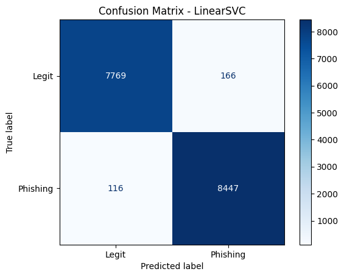
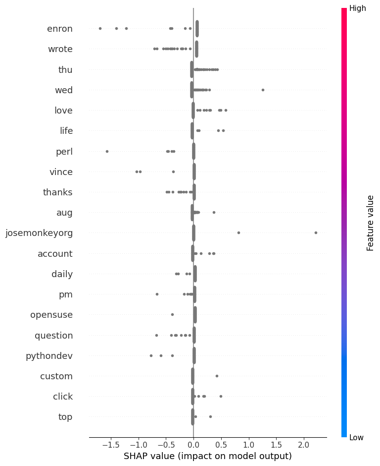

# Phishing Email Classifier
An NLP pipeline that classifies emails as phishing or legitimate using TF-IDF vectorization and LinearSVC, with SHAP and LIME explainability to show which words triggered the classification.

## Features
- Classifies emails as phishing or legit with 98% accuracy
- Compares 4 models: Naive Bayes, Logistic Regression, Random Forest, LinearSVC
- SHAP summary plot shows top features driving phishing detection
- LIME explains individual email predictions at word level
- Wordcloud visualizations for phishing vs legit vocabulary

## Language
Python 3

## Libraries Used
- pandas, numpy
- scikit-learn
- shap, lime
- matplotlib, seaborn, wordcloud
- nltk

## Installation
```bash
git clone https://github.com/rmp7439/phishing-email-classifier
cd phishing-email-classifier
pip install -r requirements.txt
```

## Usage
```bash
jupyter lab classifier.ipynb
```

## Project Structure
phishing-email-classifier/
├── classifier.ipynb
├── csv_files/
│   ├── phishing_email.csv
│   ├── CEAS_08.csv
│   ├── Enron.csv
│   ├── Ling.csv
│   ├── Nazario.csv
│   ├── Nigerian_Fraud.csv
│   └── SpamAssasin.csv
├── results/
│   ├── confusion_matrix.png
│   ├── eda_class_distribution.png
│   ├── shap_summary.png
│   ├── wordcloud_legit.png
│   ├── wordcloud_phishing.png
│   └── lime_explanation.html
├── .gitignore
└── README.md

## Results
| Model | Accuracy |
|-------|----------|
| Naive Bayes | 96% |
| Logistic Regression | 98% |
| Random Forest | 98% |
| LinearSVC | 98% |




## Future Improvements
- Fine-tune DistilBERT for higher accuracy
- CLI tool: paste email → get phishing probability
- Flask API deployment
- Real-time email scanning integration